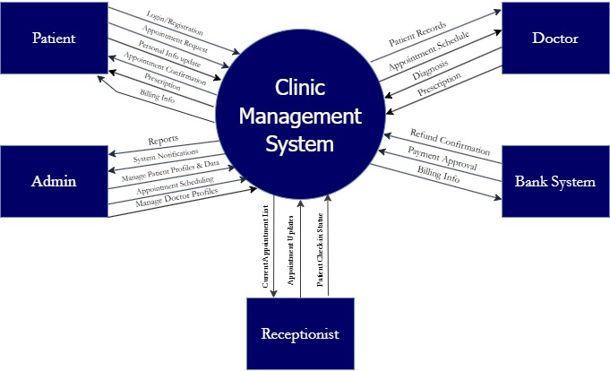
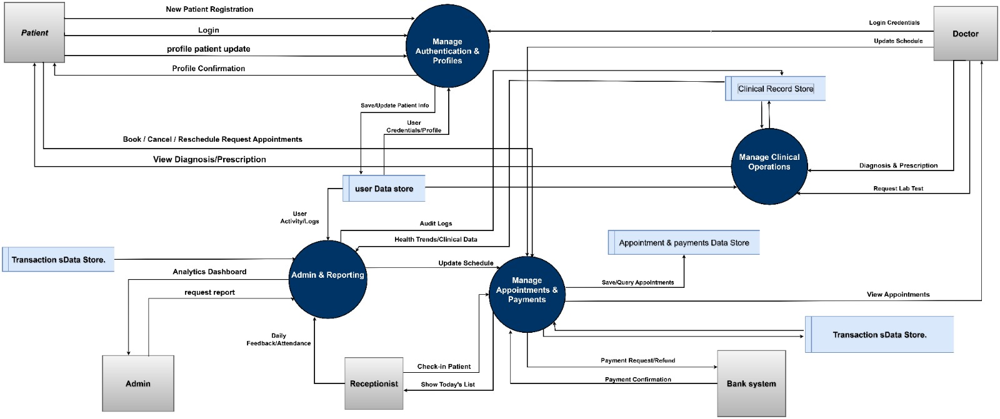
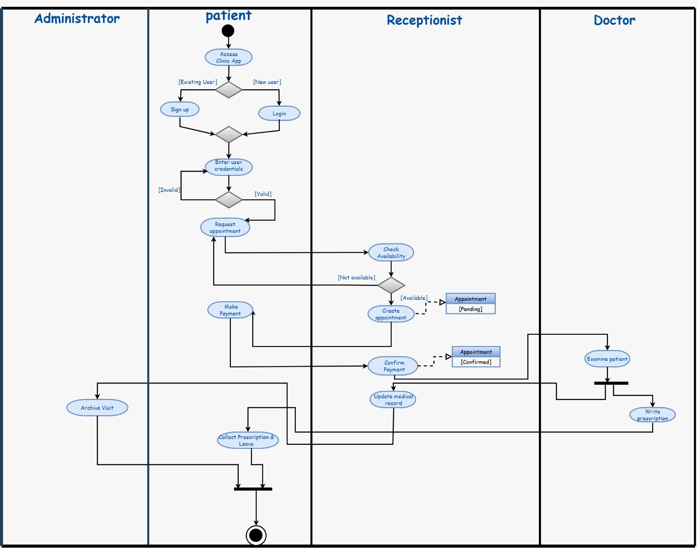
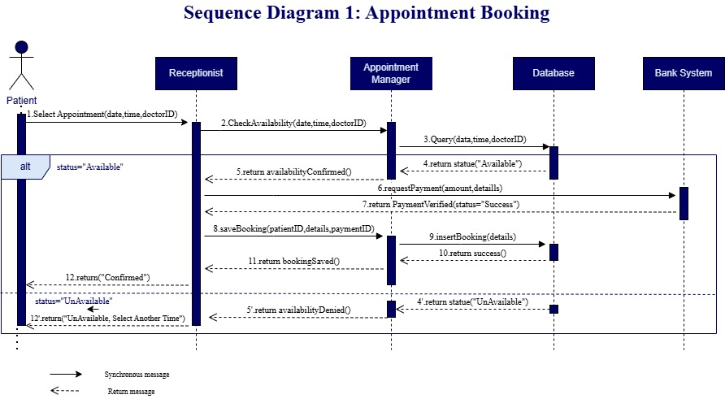
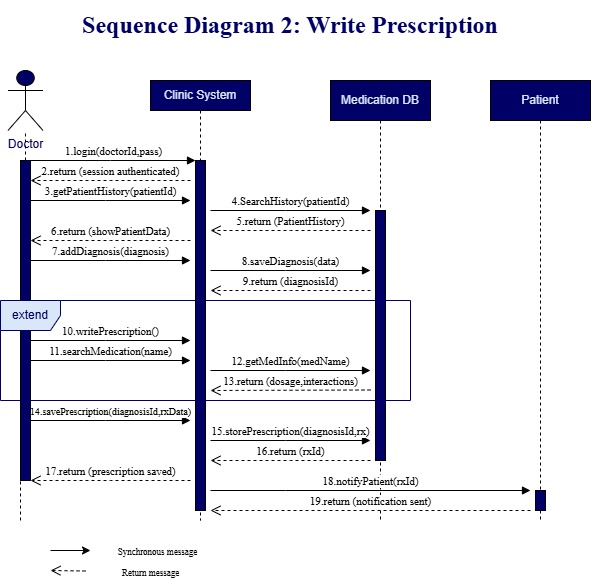
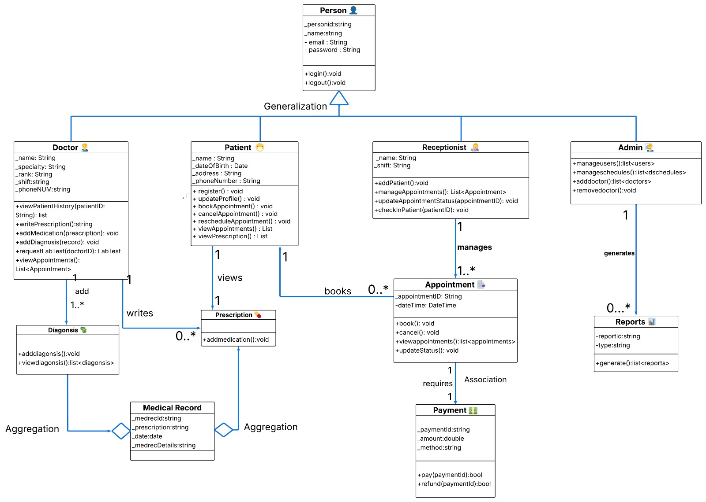

# 🏥 Clinic Management System - System Analysis & Design (SAD)

This repository contains the complete documentation and architectural design for a **Clinic Management System**. The project focuses on the full software development lifecycle (SDLC) stages, from requirement gathering to detailed system modeling.

## 🎯 Project Overview
The goal of this project was to design a comprehensive system to manage clinic operations, including patient registration, doctor scheduling, and medical record management, ensuring a seamless experience for both staff and patients.

## 🛠️ Requirements Analysis
- **Functional Requirements:** (e.g., Patient Booking, Medical History Logging, Billing, etc.)
- **Non-Functional Requirements:** Security, Scalability, and System Availability.

## 📊 System Modeling & Diagrams
The system was designed using various UML and data flow diagrams to ensure a clear architectural blueprint:

### 🌐 High-Level Design
* **Context Diagram:** Defining the system boundaries and external entities.
* 
* **DFD (Data Flow Diagrams):** Modeling the flow of information through the system processes.
* 

### 🎭 Behavioral Modeling
* **Use Case Diagram:** Identifying user roles (Admin, Doctor, Patient) and their interactions.
* 
* **Activity Diagrams:** Visualizing the step-by-step workflow of key system features.
* 
* **Sequence Diagrams:** Detailing the chronological interaction between objects for specific scenarios.
* 
* 
* 

### 🏗️ Structural Modeling
* **Class Diagram:** Defining the system's static structure, including classes, attributes, and relationships.
* 

## 🚀 Key Skills Applied
- **Software Engineering Principles:** Applying SDLC methodologies.
- **Analytical Thinking:** Transforming business needs into technical specifications.
- **Problem-Solving:** Handling complex scheduling and data consistency logic.
- **Teamwork:** Collaborative design and documentation.

## 📂 Repository Structure
- `/Diagrams`: Contains all high-resolution exported images of the diagrams.
- `/Requirements`: Detailed SRS (Software Requirements Specification) document.
- `/Analysis Of Use Case`: Detailed Analysis of the use cases.

---
**Author:** Arwa
*Computer Science Student | Passionate about Software Architecture*
